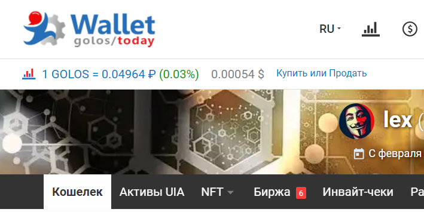

# golos-dex-lib-js
JavaScript-библиотека для работы с сервисом Golos Api-Dex (получение актуальных биржевых курсов, объемов, котировок с сайта [CoinMarketCap](https://coinmarketcap.com/currencies/golos-blockchain/) и с внутренней биржи Golos Blockchain), а также с цепочками ордеров в Golos Blockchain (обмен в несколько шагов с наибольшей выгодой).

Позволяет интегрировать этот функционал в ваше приложение или Web-сервис на основе Golos Blockchain.



_Пример интеграции. Powered by CoinMarketCap and dex-lib!_

#### В этой документации:

- [Подключение golos-dex-lib-js](#%EF%B8%8F-подключение-golos-dex-lib-js)
- [Инициализация GolosDexApi](#%EF%B8%8F-инициализация-golosdexapi)
- [apidexGetPrices](#%EF%B8%8F-apidexgetprices)
- [apidexGetAll](#%EF%B8%8F-apidexgetall)
- [apidexExchange](#%EF%B8%8F-apidexexchange)
- [getExchange](#%EF%B8%8F-getexchange)
- [makeExchangeTx](#%EF%B8%8F-makeexchangetx)
- [makeOrderID, ORDER_MAX_EXPIRATION](#%EF%B8%8F-makeorderid-order_max_expiration)

---

### [⬆️](#в-этой-документации) Подключение golos-dex-lib-js

NPM:

```
npm install golos-lib-js golos-dex-lib-js
```

yarn:

```
yarn add golos-lib-js golos-dex-lib-js
```

Без NPM или yarn:

```html
<script src="https://cdn.jsdelivr.net/npm/golos-lib-js@latest/dist/golos.min.js"></script>
<script src="https://cdn.jsdelivr.net/npm/golos-dex-lib-js@latest/dist/golos-dex.min.js"></script>
<script>
  здесь будем писать код с использованием библиотеки
</script>
```

В продакшне рекомендуем вам скачать эти файлы и загрузить к себе сайт. Тогда и без того легкие библиотеки (golos-dex-lib-js - 15 Кб - 0.005 сек при слабом Wi-Fi) будут загружаться молниеносно.

### [⬆️](#в-этой-документации) Инициализация GolosDexApi

```html
<script>
// import нужны при использовании модулей, Node.js и т.п
// В обычных страницах просто уберите их
import golos from 'golos-lib-js' // нужно для работы большинства метдов
import GolosDexApi from 'golos-dex-lib-js'

try {
    new GolosDexApi(golos, {
        host: 'https://api-dex.golos.app' // то же самое по умолчанию
    })
} catch (err) {
    console.error('GolosDexApi init error:', err)
}

const { dex } = golos.libs

// и методы можно вызывать по принципу: dex.makeExchangeTx(...)
</script>
```

Способ без инъекции в golos-lib:

```js
let dex

try {
    dex = new GolosDexApi(golos, {
        host: 'https://api-dex.golos.app',
        patch_golos: false
    })
} catch (err) {
    console.error('GolosDexApi init error:', err)
}

// и методы можно вызывать по принципу: dex.makeExchangeTx(...)
```

### [⬆️](#в-этой-документации) apidexGetPrices

Получение с CMC (CoinMarketCap) цены за выбранный токен в RUB, USD.

Кеширует ответ на некоторое время, чтобы если уже есть ответ, не тратить время на сетевой запрос к Api-Dex и не замедлять работу вашего UI этим. (Этот интервал вы можете менять - `cacheTime`.)  
Не путайте этот кеш - с кешем внутри сервера Api-Dex (он нужен, чтобы не слишком часто опрашивать CMC. Этот интервал вы менять не можете, В ответе есть поле `from_cache`, которое указывает, взяты ли данные из CMC или из кеша.)

```js
let res = await dex.apidexGetPrices({
  sym: 'GOLOS',
  // timeout: 2000, // таймаут запроса - на случай если api-dex не ответит. По умолчанию: 2000 мс
  // cacheTime: 60000, // время жизни кеша. По умолчанию: 60000 мс
})
console.log(res.price_usd)
console.log(res.price_rub)
console.log(res.page_url)
```

### [⬆️](#в-этой-документации) apidexGetAll

Аналогично apidexGetPrices, но получает данные сразу по всем индексируемым токенам.

```js
let res = await dex.apidexGetAll()
console.log(res)
//
// или с настройкой параметров:
res = await dex.apidexGetAll({
  timeout: 2000,
  cacheTime: 60000
})
console.log(res)
```

### [⬆️](#в-этой-документации) apidexExchange

Получает с Api-Dex данные о том, за сколько таких-то токенов (допустим GOLOS) можно купить такой-то токен (допустим GBG) на внутренней бирже Golos Blockchain. Или наоборот, за сколько можно продать.

Это старая версия данного метода, поддерживающая только прямой обмен (без вариантов с несколькими шагами с промежуточными токенами).

Поддерживается `timeout` как и в методах выше. В случае зависания запроса - он вернет `null`, а не заставит пользователя ждать бесконечно.

В случае других ошибок также возвращается `null`, а в логи (`console.error`) пишется информация об ошибке.

```js
// за сколько GOLOS можно продать 1.000 GBG
let res = await dex.apidexExchange({
   sell: '1.000 GBG',
   buySym: 'GOLOS',
})
console.log(res.result.toString())
console.log(JSON.stringify(res.best_price))
console.log(JSON.stringify(res.limit_price))
//
// за сколько GOLOS можно купить 1.000 GBG
res = await dex.apidexExchange({
   sell: '1.000 GBG',
   buySym: 'GOLOS',
   direction: 'buy', // а для "продать" - 'sell' - по умолчанию
})
console.log(res.result.toString())
console.log(JSON.stringify(res.best_price))
console.log(JSON.stringify(res.limit_price))
```

### [⬆️](#в-этой-документации) getExchange

Получает с ноды Golos Blockchain данные о том, за сколько таких-то токенов (допустим GOLOS) можно купить такой-то токен (допустим GBG) на внутренней бирже Golos Blockchain. Или наоборот, за сколько можно продать.

В отличие от `apidexExchange`, поддерживает не только прямой обмен, но и "многоходовый", допустим: продать GOLOS за YMUSDT, затем YMUSDT за GBG. Это в некоторых случаях может быть намного выгоднее.

```js
let res = await dex.getExchange({
//  node: 'wss://apibeta.golos.today/ws', // С какой ноды получать данные. Если не задано - то та же, что используется golos-lib-js
    amount: '1.000 GBG',
    symbol: 'GOLOS',
    direction: 'buy', // 'sell'
//  hidden_assets: ['SCAMCOIN'], // список токенов, которых не должно быть в шагах "многоходовки"
//  min_to_receive: {
//      direct: '0.900 GBG', // выдать цепочку прямого обмена только если она позволяет купить не менее 0.900 GBG
//      multi: '1.100 GBG' // выдавать цепочки многоходового обмена только если они позволяют купить не менее 1.100 GBG
//  }
})
console.log(res)
```

В ответе будут следующие поля:
- `direct` - цепочка прямого обмена, если есть. Иначе - `false`.
- `best` - лучшая "многоходовая" цепочка, если есть. Иначе - `false`.
- `all_chains` - все доступные цепочки, отсортированные от лучшей к худшим.

`all_chains` включает в себя и `best`, и `direct`.  
`best` может совпадать с `direct`.  
В целом, в каждой цепочке есть полe `syms`, представляющее собой схему обмена (например `['GOLOS', 'GBG"]` у прямой, или `['GOLOS', 'YMUSDT', 'GBG']`). По неу можно отличать одну цепочку от других.

#### Поля цепочки

- `res` - сколько вы получите (`sell`) или потратите (`buy`).
- `steps` - набор описаний ордеров, которые следует разместить для прохода цепочки. "Многоходовые" ордера следует размещать **единой транзакцией**, сформированной с помощью `makeExchangeTx`.
- `syms` - схема обмена и идентификатор цепочки. См. выше.
- `best_price` - лучшая цена цепочки. На каждом из шагов цепочки может требоваться срабатывание сразу с несколькими ордерами, от лучших к худшим, чтобы набрать нужную сумму. `best_price` - цена лучшего ордера.
- `limit_price` - цена худшего ордера.
- `buy` - цепочка на продажу (если `direction: 'sell'`, то `false`) или покупку.

### [⬆️](#в-этой-документации) makeExchangeTx

Формирует многоходовую (или одноходовую) транзакцию ордеров из `steps` цепочки.

```js
let operations = await dex.makeExchangeTx(chain.steps, {
    owner: 'cyberfounder', // пользователь, размещающий ордера
    fill_or_kill: true, // следует ли отменять транзакцию, если ордера не удалось наполнить. Для "многоходовых" цепочек обязательно true.
//  op_type: 'limit_order_create', // на данный момент поддерживается лишь такой вариант
//  orderid: 12454, // Задать определенный orderid или кастомную функцию для его формирования, параметры: `(op, i, ops, step)`
})
```

Затем `operations` надо отправить в транзакции, подписанной `active`-ключом аккаунта `cyberfounder`.

### [⬆️](#в-этой-документации) makeOrderID, ORDER_MAX_EXPIRATION

Утилиты, которые можно использовать при создании любых лимитных ордеров на внутренней бирже Golos Blockchain.

Генерирует уникальный `orderid` (для  `limit_order_create`):
```js
const orderid = dex.makeOrderID()
```

`ORDER_MAX_EXPIRATION` - константа, которую можно подставить в поле `expiration` в операции `limit_order_create`, и получится ордер с неистекающим сроком размещения.
